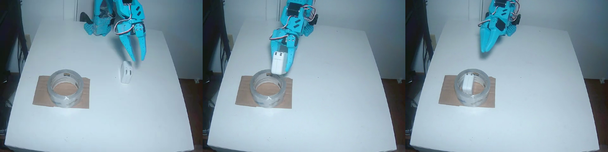
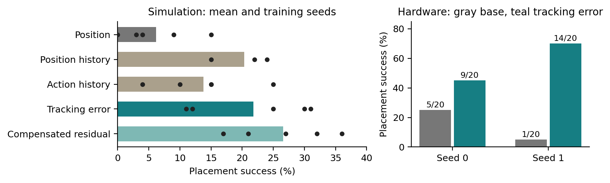

# Tracking error as an observation for behavior cloning on low-cost arms

Code, evaluation records, and manuscript for a study of one cheap observation:
the difference between the position a servo was told to reach and the
position it actually reached. On a position-controlled hobby servo that
difference is present in every recorded dataset, costs nothing at inference
time, and carries information about load and contact. This repository asks
whether giving it to a behavior-cloning policy helps.

Platform: the SO-101 arm (STS3215 servos), one overhead camera, ACT policies
trained with LeRobot. The Python package `tracking_error_il` is the MuJoCo
simulation benchmark used for the controlled comparison.

<p align="center">
  <a href="media/real_rollout_delta_s1.mp4">
    
  </a>
</p>

*Autonomous rollout of a tracking-error policy (training seed 1) on the
physical arm, after a fixed demonstration replay brings the arm near the
grasp. Click the image for the clip. This is a showcase recording. It is
not one of the evaluated trials and its outcome is not in any count below.*

## Result

<p align="center">
  
</p>

| setting | position only | with tracking error | notes |
|---|---|---|---|
| simulation, 280 scripted demos, 100 eval episodes | 6.2% | 21.8% | means over 5 training seeds; position history alone reaches 20.3% (3 seeds) |
| hardware, seed 0, 20 paired trials | 5/20 | 9/20 | exact McNemar p = 0.29 |
| hardware, seed 1, 20 paired trials | 1/20 | 14/20 | exact McNemar p = 0.001 |
| hardware, seed 2 | 0/6 | 0/6 | interrupted by recurring servo overload faults |

On the arm, tracking error places 23 of 40 paired trials against 6 of 40 for
position-only policies (stratified exact test p = 0.0005), replicated across
two training seeds, though the size of the effect differs between seeds. In
simulation a position-history input recovers most of the gain, so the finding
is that the single-timestep proprioceptive default omits temporal information
a policy needs, and tracking error is the channel every existing log already
contains. It also keeps varying where the gripper's load register saturates at
a vendor torque limit in 16.5% of demonstration frames. A study of 16 public
teleoperation datasets (546 episodes) shows that large tracking error at grasp
time marks resistance, not a successful grasp. Full protocol,
statistics, and limitations are in [`paper/main.tex`](paper/main.tex)
([PDF](paper/main.pdf)).

## Simulation validation

The controlled comparison is a simulation grid: one ACT policy per observation
design and training seed, 280 scripted demonstrations, 100 evaluation episodes
with shared scene seeds. Means over seeds (5 seeds, 3 for the history designs):

| design | code name | placement |
|---|---|---|
| position only | `base` | 6.2% |
| action history | `base_hist` | 13.8% |
| two-command history | `base_hist2` | 14.7% |
| position history | `ghist` | 20.3% |
| tracking error | `delta` | 21.8% |
| compensated residual | `excess` | 26.6% |

Only the tracking-error and compensated-residual gains over the base clear the
preregistered resolution rule, and no pairwise contrast survives a Holm
adjustment across all 28 pairs.

Before any policy was trained, the simulated plant was characterised with
scripted experts that differ only in the signal that sets the grip: a fixed
jaw angle (clamp), the quantised tracking error, or the true contact force
(oracle). Placements out of 30 randomised episodes:

| crush limit | tracking error, q=1 | q=4 | q=8 | q=16 | q=32 | clamp | oracle |
|---|---|---|---|---|---|---|---|
| none | 22 | not run | not run | not run | not run | 29 | 20 |
| 100 N | 11 | 11 | 9 | 1 | 0 | 0 | 12 |
| 120 N | 17 | 17 | 16 | 10 | 0 | 0 | 14 |
| 160 N | 20 | 20 | 19 | 17 | 11 | 0 | 17 |

Without a limit the clamp wins because nothing penalises a 355 N grip. With a
limit it fails every episode, tracking error at the encoder's native quantum
matches the oracle within a few placements, and coarsening the quantum
destroys the task as a cliff that moves with the margin. That is what makes
the channel worth testing in a learned policy; it says nothing about the
physical servo, which the paper's measurement appendix treats separately.
Details and the resolution-sweep procedure are in
[`docs/simulation.md`](docs/simulation.md).

## Supplementary analyses

Everything below is generated by `scripts/paper/supplementary_analysis.py`
and `scripts/real/checkpoint_sensitivity.py` from files under `results/`, and
appears in the paper's appendices.

| analysis | what it shows |
|---|---|
| stratified hardware statistics | pooled discordant pairs 20 vs 3 over the completed seeds (p = 0.0005), odds ratio 6.7, no detectable heterogeneity between seeds |
| power of the 20-pair protocol | 0.17 under seed 0's observed discordance structure, 0.97 under seed 1's |
| jaw-trace classification of all 91 recorded trajectories (92 rollouts) | every tracking-error success closed once and held; seed 2's rollouts mostly never closed, consistent with the servo fault |
| checkpoint sensitivity | zeroing the tracking-error input moves the jaw command by 13 units where the load register is pinned, 3 elsewhere; offline error does not rank the seeds as hardware did |
| demonstration coverage of the replay | grasp closure at median frame 331 of 400, after the 115-command replay in 48 of 50 demonstrations |
| simulation contrasts | Welch intervals and Holm adjustment for all 28 design pairs |
| corpus forest plot | per-dataset effect sizes with intervals, and their stability under command offsets |
| load-register figure | static bench fit and the demonstration-frame saturation at the ±500 limit |

## What is not finished

A matched position-history control on hardware. The simulation grid says
position history performs like tracking error, so the hardware gain may come
from any temporal input. The comparison is pre-registered in
[`docs/hardware/preregistration_2026-09-07_history_control.md`](docs/hardware/preregistration_2026-09-07_history_control.md);
the matched checkpoints were trained with `scripts/real/run_history_control_training.sh`
(logs under `results/hardware/real_delta_replication/`). The first seed-1
session was interrupted after 9 complete pairs by a gripper servo that stopped
following jaw commands, with a displaced camera; its 19 rollouts are kept in
`results/hardware/real_history_control_s1_trials.json` and the paper's
Appendix H reports the session as interrupted with no test assigned. A clean
20-pair session is still needed for each seed:

```bash
bash scripts/bench/run_hw_history_control.sh 1 --out results/hardware/real_history_control_s1_trials_v2.json
bash scripts/bench/run_hw_history_control.sh 0
make paper
```

The appendix status sentence and table regenerate from whatever trial records
exist.

## Media

Each clip is labeled by what controls the arm. Nothing here was edited beyond
trimming.

| clip | what it shows | control |
|---|---|---|
| [`media/real_rollout_delta_s1.mp4`](media/real_rollout_delta_s1.mp4) | Adapter placed in a tape roll on the physical SO-101, seed 1 tracking-error checkpoint, 400 policy steps after replay of 115 demonstration commands. Showcase recording, outcome not annotated. | autonomous policy |
| [`media/teleoperation.mp4`](media/teleoperation.mp4) | One of the 50 training demonstrations. A human drives the leader arm. | human teleoperation |
| [`media/simulation_delta.mp4`](media/simulation_delta.mp4) | An ACT policy with tracking-error observations in the MuJoCo benchmark. Rendered forces describe the simulator, not the robot. | autonomous policy, simulation |

## Repository layout

```
src/tracking_error_il/   MuJoCo pick-and-place scene, scripted experts, LeRobot-schema collection
scripts/
  sim/             demonstration collection, ACT training, the observation-design grid, crush and guard screens
  real/            real-data training, policy execution on the arm, paired trial runner, trajectory analysis
  corpus/          the archived-teleoperation study
  paper/           evidence builder, supplementary analyses, number checks
  bench/           hardware setup: teleoperation and recording, servo calibration, lerobot patch snapshot
results/
  simulation/      one JSON per trained policy (design x seed), crush-tier and guard screens
  hardware/        trial outcomes, per-trial trajectories, session manifests and incident records
  corpus/          per-dataset effect sizes and the command-offset sweep
  calibration/     static load measurements on one servo
  showcase/        trajectory records of the showcase rollouts
paper/             main.tex, refs.bib, generated tables and the evidence JSON they come from
figures/paper/     manuscript figures (eight are included by main.tex; PNG twins for the README)
docs/              simulation benchmark notes, hardware pre-registrations and diagnostics
media/             the clips and stills used above
tests/             simulation environment tests
```

Every number in the paper is rebuilt from `results/` by `scripts/paper/`;
the analysis scripts that produced each record are named in
`results/README.md`, together with the few session notes written by hand. [`scripts/README.md`](scripts/README.md) and
[`results/README.md`](results/README.md) index both trees and give the
mapping between the design names in the paper and the identifiers in the code.

## Install

```bash
pip install -e ".[data,video,analysis,dev]"
make test
```

Training and hardware scripts additionally need the `train` extra (`torch`,
`safetensors`, `opencv-python`, `lerobot`). Every `make` target accepts
`PYTHON=/path/to/python` when the project lives in a virtual environment that
is not first on your `PATH`.

Python 3.10 or newer. Rendering uses EGL and works headless. The real-pipeline
test needs `torch` and is skipped when it is not installed. `make test` is
used instead of bare `pytest` because a system ROS install registers pytest
plugins globally that fail on import; the Makefile disables plugin
autoloading. Nothing here uses ROS.

## Reproduce the paper's numbers

Everything the manuscript reports about the hardware trials, the simulation
grid, and the corpus study is recomputed from `results/` and checked against
the text:

```bash
make paper
```

which runs, in order:

```bash
python scripts/paper/build_paper_evidence.py     # tables, evidence.json, the two main figures
python scripts/paper/supplementary_analysis.py   # supplementary statistics, tables and figures
latexmk -pdf -interaction=nonstopmode -halt-on-error -cd paper/main.tex
python scripts/paper/check_paper_numbers.py      # every reported value must match results/
```

The checker fails if a hardware count, a simulation mean, a corpus count, a
supplementary statistic, or a required disclosure sentence in the manuscript
drifts from the data. `make paper-anon` builds the same source in CoRL
submission mode (anonymous author block, line numbers) to `paper/main_anon.pdf`
and fails if the PDF text or metadata still carries an identifying string.

## Data and checkpoints

The repository ships the evaluation records under `results/`, from which every
number in the paper is rebuilt. It does not yet host the raw inputs:

| artifact | local path | status |
|---|---|---|
| 50 teleoperated SO-101 demonstrations (LeRobot dataset) | `data/real/pickplace_real_v0` | to be released with the paper |
| hardware checkpoints, 3 seeds x 2 designs | `checkpoints/real50_base_v2`, `real50_delta_v3_s0`, `real50_{base,delta}_v3_s{1,2}` | to be released with the paper |
| public SO-100/101 datasets for the corpus study | `data/corpus/raw` | downloaded from the Hugging Face Hub by `scripts/corpus/corpus_delta_outcome.py --fetch`; dataset ids are in `results/corpus/corpus_delta_outcome.json` |
| 280 scripted simulation demonstrations | `data/demos_v3` | regenerate with `scripts/sim/collect_guarded.py` |
| simulation grid checkpoints | `checkpoints/grid_*` | regenerate with `scripts/sim/run_grid.sh` |

Until the hosted copies exist, the hardware trials and the offline checkpoint
analyses in the appendix cannot be re-run from a fresh clone; everything else
can.

## Simulation benchmark

The package exposes a randomized pick-and-place task, three scripted experts
that differ only in the grip signal they read, and dataset collection in the
same schema as the public SO-100/101 datasets, so that
`delta = action[t-1] - state[t]` is reconstructable downstream exactly as it
is from real data.

```python
from tracking_error_il import DemoEnv

env = DemoEnv(seed=0)
result, frames = env.rollout()                # one scripted episode
env.collect(200, root="~/data/pick_place")    # LeRobotDataset
```

The learning grid in the paper trains one ACT policy per observation design
and seed on 280 scripted demonstrations:

```bash
python scripts/sim/collect_guarded.py --episodes 280 --root data/demos_v3
python scripts/sim/train_act.py --arm delta --root data/demos_v3 --steps 12000 --image-size 96 \
    --seed 0 --eval-episodes 100 --eval-crush -1 --json results/simulation/grid_C_delta_s0.json
```

`scripts/sim/run_grid.sh` runs the whole grid; `scripts/sim/modal_grid.py`
runs it on Modal from `scripts/sim/grid_spec.json`. The environment, grip
modes, resolution knob, and the scripted-expert measurements are documented
in [`docs/simulation.md`](docs/simulation.md).

## Hardware pipeline

The real pipeline uses a LeRobot checkout with local patches; see
[`scripts/bench/lerobot-patch/README.md`](scripts/bench/lerobot-patch/README.md)
for what changed and how to restore it. Set `LEROBOT` to that checkout and
`SO101_VENV_PYTHON` to the interpreter it is installed in. The entry points
are:

```bash
scripts/bench/arms.sh record pickplace_real_v0 50     # teleoperate and record demonstrations
python scripts/real/train_act_real.py --arm delta --root data/real/pickplace_real_v0 \
    --steps 6000 --seed 1 --out checkpoints/real50_delta_v3_s1
bash scripts/bench/run_hw_replication.sh 1            # 20 paired base/tracking-error trials, seed 1
bash scripts/bench/record_demo.sh                     # one showcase rollout with video
```

Trials are paired by physical reset with alternating order, the operator
enters each outcome, and every trial writes a trajectory to
`results/hardware/real_trial_traj/`. The pre-registered decision rules and the
per-session diagnostics are in [`docs/hardware/`](docs/hardware/). Read the
safety notes at the top of `scripts/real/run_policy_real.py` before letting a
policy command the arm.

## Citation

```bibtex
@misc{abuelsamen2026trackingerror,
  title  = {Tracking Error as an Observation for Behavior Cloning on Low-Cost Arms},
  author = {Abuelsamen, Luai},
  year   = {2026},
  note   = {Preprint. Code and evaluation records: https://github.com/luaiabuelsamen/tracking-error-il}
}
```

## License

Apache-2.0.
